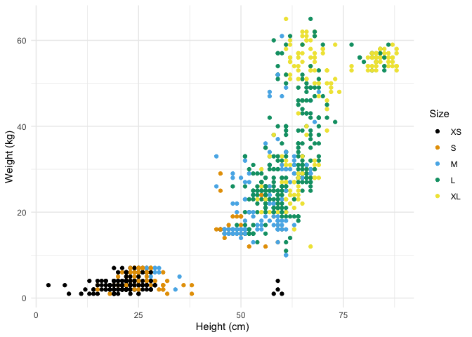
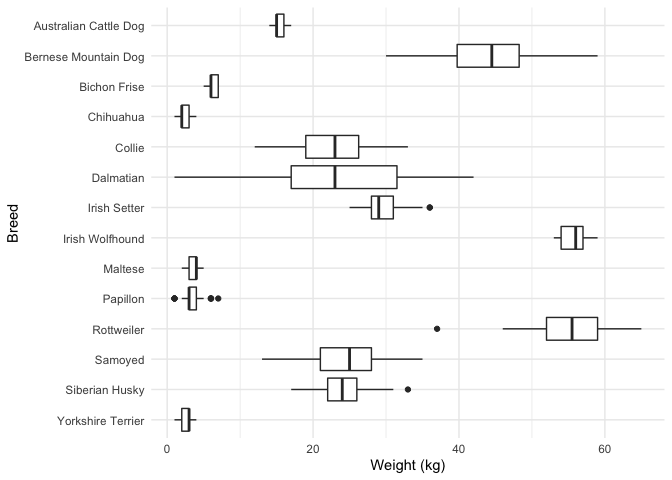
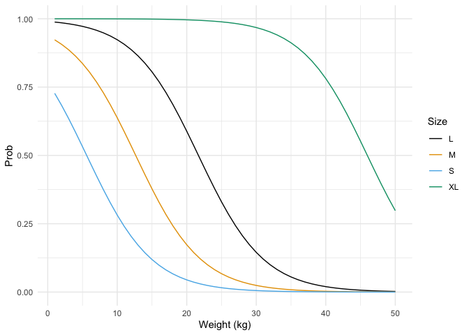

    library(tidyverse)
    library(broom)
    library(betareg)
    library(ggridges)
    library(patchwork)
    library(MASS)

logit (*P*\[size&lt;*S*\]) =  − 3.92 − 2.87 × \[breed=BerneseMountainDog\] − (−3.05) × \[breed=BichonFrise\] − …

# Introduction

Another type of regression that I do not think gets enough love is
ordinal logistic regression - where the dependent variable is ordinal.
For example classifying dogs by sizes as XS, S, M, L and XL - the sizes
are ordered, but there may not necessarily be any meaning to the
differences between them, as the difference between XS and S may be
vastly different than the difference between L and XL.

Here we will show how to do some simple examples in R, assuming the
reader is familiar with R, ggplot, and the lm function.

Once again, the focus will be on *using* R, and leave the theoretical
derivations, etc to the textbooks & papers.

# Data

So lets get started. We have weights and heights from a thousand dogs,
from about a dozen different breeds. Each dog has been assigned an
ordinal ‘size’, ranging from XS to XL, and they have been assigned by
people looking at the dog.

In the code you can see how the sizes were actually assigned by weight,
with some randomness creeping in to assign to neighbouring categories.
And then if the dog is particularly tall or short the size may be
changed accordingly.

    set.seed(2022)
    n <- 1000

    df_breeds <- tribble(
      ~breed, ~height_min, ~height_max, ~weight_min, ~weight_max, # male
      "Rottweiler", 61, 69, 50, 60,
      "Yorkshire Terrier", 20, 23, 2, 3,
      "Siberian Husky", 54, 60, 20, 27,
      "Bernese Mountain Dog", 64, 70, 38, 50,
      "Chihuahua", 15, 30, 1.5, 3,
      "Maltese", 21, 25, 3, 4,
      "Collie", 51, 61, 18, 29,
      "Bichon Frise", 23, 28, 6, 7,
      "Dalmatian", 58, 61, 15, 32,
      "Papillon", 20, 28, 2.3, 4.5,
      "Australian Cattle Dog", 46, 51, 15, 16,
      "Samoyed", 53, 60, 20, 30,
      "Irish Setter", 64, 67, 27, 32,
      "Irish Wolfhound", 81, 86, 54, 57
    ) %>%
      mutate(
        mean_height = (height_max + height_min) / 2,
        mean_weight = (weight_max + weight_min) / 2,
        sd_height = height_max - mean_height,
        sd_weight = weight_max - mean_weight,
      )

    df <- df_breeds %>%
      sample_n(n, replace = TRUE) %>%
      mutate(
        height = pmax(1, round(rnorm(n, mean_height, sd_height))),
        weight = pmax(1, round(rnorm(n, mean_weight, sd_weight)))
      )

    df <- df %>%
      mutate(
        sz = case_when(
          weight < 5 ~ "XS",
          weight < 10 ~ "S",
          weight < 20 ~ "M",
          weight < 50 ~ "L",
          TRUE ~ "XL"
        )
      )

    df$sz2 <- NA
    df$sz2[df$sz == "XS"] <- sample(c("XS", "S"), sum(df$sz == "XS"), replace = TRUE, prob = c(0.8, 0.2))
    df$sz2[df$sz == "S"] <- sample(c("XS", "S", "M"), sum(df$sz == "S"), replace = TRUE, prob = c(0.15, 0.7, 0.15))
    df$sz2[df$sz == "M"] <- sample(c("S", "M", "L"), sum(df$sz == "M"), replace = TRUE, prob = c(0.15, 0.7, 0.15))
    df$sz2[df$sz == "L"] <- sample(c("M", "L", "XL"), sum(df$sz == "L"), replace = TRUE, prob = c(0.15, 0.7, 0.15))
    df$sz2[df$sz == "XL"] <- sample(c("L", "XL"), sum(df$sz == "XL"), replace = TRUE, prob = c(0.2, 0.8))

    df <- df %>%
      mutate(
        sz3 = case_when(
          (sz2 == "XS") & (height > (mean_height + sd_height)) ~ "S",
          (sz2 == "S") & (height > (mean_height + sd_height)) ~ "M",
          (sz2 == "S") & (height < (mean_height - sd_height)) ~ "XS",
          (sz2 == "M") & (height > (mean_height + sd_height)) ~ "L",
          (sz2 == "M") & (height < (mean_height - sd_height)) ~ "S",
          (sz2 == "L") & (height > (mean_height + sd_height)) ~ "XL",
          (sz2 == "L") & (height < (mean_height - sd_height)) ~ "M",
          (sz2 == "XL") & (height < (mean_height - sd_height)) ~ "L",
          TRUE ~ sz2
        )
      )

    df <- df %>%
      dplyr::select(-sz, -sz2) %>%
      rename(sz = sz3)
    df <- df %>% mutate(size = factor(sz, levels = c("XS", "S", "M", "L", "XL")))
    df <- df %>% dplyr::select(-contains(c("min", "max", "mean", "sd")))

We end up with a data frame that looks like this:

    df %>% sample_n(5) %>% head()

    ## # A tibble: 5 × 5
    ##   breed                height weight sz    size 
    ##   <chr>                 <dbl>  <dbl> <chr> <fct>
    ## 1 Bernese Mountain Dog     59     52 M     M    
    ## 2 Papillon                 22      2 S     S    
    ## 3 Chihuahua                28      4 XS    XS   
    ## 4 Yorkshire Terrier        22      3 XS    XS   
    ## 5 Dalmatian                59     24 M     M

We can see the dogs sizes in the following plot.

    df %>%
      ggplot(aes(x = height, y = weight, colour = size)) +
      geom_point() +
      theme_minimal() +
      ggthemes::scale_colour_colorblind() +
      labs(
        x = "Height (cm)",
        y = "Weight (kg)",
        colour = "Size"
      )

We can see the weights of the dogs by breed as follows:

    df %>%
      ggplot(aes(x = fct_rev(breed), y = weight)) +
      geom_boxplot() +
      coord_flip() +
      theme_minimal() +
      ggthemes::scale_colour_colorblind() +
      labs(
        x = "Breed",
        y = "Weight (kg)"
      )

# Ordinal Regression

The goal will be to build an ordinal regression model, predicting the
size of a dog based on the other variables. Just doing a multinomial
logistic would not be appropriate here, because there is an ordering to
the sizes: XS&lt;S&lt;M&lt;L&lt;XL.

## Small models

### size ~breed

First we’ll look at sizes as a function of breed only.

    mod <- polr(size ~ breed, data = df, Hess = TRUE)
    summary(mod)

    ## Call:
    ## polr(formula = size ~ breed, data = df, Hess = TRUE)
    ## 
    ## Coefficients:
    ##                            Value Std. Error t value
    ## breedBernese Mountain Dog  2.872     0.3373   8.516
    ## breedBichon Frise         -3.046     0.3697  -8.239
    ## breedChihuahua            -5.010     0.4396 -11.397
    ## breedCollie                1.325     0.3261   4.063
    ## breedDalmatian             1.378     0.3209   4.294
    ## breedIrish Setter          2.268     0.3262   6.953
    ## breedIrish Wolfhound       4.978     0.3961  12.567
    ## breedMaltese              -5.217     0.4363 -11.957
    ## breedPapillon             -4.964     0.4105 -12.094
    ## breedRottweiler            4.228     0.3553  11.899
    ## breedSamoyed               2.261     0.3596   6.288
    ## breedSiberian Husky        2.653     0.3290   8.064
    ## breedYorkshire Terrier    -5.384     0.4539 -11.861
    ## 
    ## Intercepts:
    ##      Value    Std. Error t value 
    ## XS|S  -3.9199   0.3377   -11.6066
    ## S|M   -1.3555   0.2424    -5.5908
    ## M|L    1.0259   0.2312     4.4367
    ## L|XL   3.7103   0.2699    13.7482
    ## 
    ## Residual Deviance: 1768.53 
    ## AIC: 1802.53

As is the case with typical R regression outputs, there is a missing
category, the reference level. In this case it is the Australian Cattle
Dog.

Note p-values are not included. If you want them you’ll have to roll
them in yourself:

    coef(summary(mod)) %>%
      as_tibble(rownames = "varn") %>%
      mutate(
        pval = pnorm(abs(`t value`), lower.tail = FALSE) * 2,
        pval = round(pval, 5)
      )

    ## # A tibble: 17 × 5
    ##    varn                      Value `Std. Error` `t value`    pval
    ##    <chr>                     <dbl>        <dbl>     <dbl>   <dbl>
    ##  1 breedBernese Mountain Dog  2.87        0.337      8.52 0      
    ##  2 breedBichon Frise         -3.05        0.370     -8.24 0      
    ##  3 breedChihuahua            -5.01        0.440    -11.4  0      
    ##  4 breedCollie                1.33        0.326      4.06 0.00005
    ##  5 breedDalmatian             1.38        0.321      4.29 0.00002
    ##  6 breedIrish Setter          2.27        0.326      6.95 0      
    ##  7 breedIrish Wolfhound       4.98        0.396     12.6  0      
    ##  8 breedMaltese              -5.22        0.436    -12.0  0      
    ##  9 breedPapillon             -4.96        0.410    -12.1  0      
    ## 10 breedRottweiler            4.23        0.355     11.9  0      
    ## 11 breedSamoyed               2.26        0.360      6.29 0      
    ## 12 breedSiberian Husky        2.65        0.329      8.06 0      
    ## 13 breedYorkshire Terrier    -5.38        0.454    -11.9  0      
    ## 14 XS|S                      -3.92        0.338    -11.6  0      
    ## 15 S|M                       -1.36        0.242     -5.59 0      
    ## 16 M|L                        1.03        0.231      4.44 0.00001
    ## 17 L|XL                       3.71        0.270     13.7  0

So what do all these coefficients mean?

First notice that there are two types of estimates provided,
*coefficient* estimates and *scale* estimates:

    mod %>% tidy()

    ## # A tibble: 17 × 5
    ##    term                      estimate std.error statistic coef.type  
    ##    <chr>                        <dbl>     <dbl>     <dbl> <chr>      
    ##  1 breedBernese Mountain Dog     2.87     0.337      8.52 coefficient
    ##  2 breedBichon Frise            -3.05     0.370     -8.24 coefficient
    ##  3 breedChihuahua               -5.01     0.440    -11.4  coefficient
    ##  4 breedCollie                   1.33     0.326      4.06 coefficient
    ##  5 breedDalmatian                1.38     0.321      4.29 coefficient
    ##  6 breedIrish Setter             2.27     0.326      6.95 coefficient
    ##  7 breedIrish Wolfhound          4.98     0.396     12.6  coefficient
    ##  8 breedMaltese                 -5.22     0.436    -12.0  coefficient
    ##  9 breedPapillon                -4.96     0.410    -12.1  coefficient
    ## 10 breedRottweiler               4.23     0.355     11.9  coefficient
    ## 11 breedSamoyed                  2.26     0.360      6.29 coefficient
    ## 12 breedSiberian Husky           2.65     0.329      8.06 coefficient
    ## 13 breedYorkshire Terrier       -5.38     0.454    -11.9  coefficient
    ## 14 XS|S                         -3.92     0.338    -11.6  scale      
    ## 15 S|M                          -1.36     0.242     -5.59 scale      
    ## 16 M|L                           1.03     0.231      4.44 scale      
    ## 17 L|XL                          3.71     0.270     13.7  scale

What this all means is that (using the square bracket Iverson notation
that \[statement\] is equal to 1 if the statement is true, and 0
otherwise):

( P )=-3.92-2.87 -(-3.05) -

( P )=-1.36-2.87 -(-3.05) - …

( P )=3.71-2.87 -(-3.05) -

Lets calculate one of these manually. If the dog is (say) a Dalmatian,
then

( P )=-3.92-1.38

( P )=-1.36-1.38

( P )=1.03-1.38

( P )=3.71-1.38

or

( P )=-5.3

( P )=-2.74

( P )=-0.35

( P )=2.33

Or

    plogis(c(-5.3, -2.74, -0.35, 2.33))

    ## [1] 0.004966802 0.060653903 0.413382421 0.911331337

So the probability that a dalmatian is less than S = 0.005, M = 0.061, L
= 0.413, XL = 0.911. Thus, the probability that a dalmatian is less than
or equal to XS = 0.005, S = 0.061, M = 0.413,L = 0.911, and finally the
probability that a dalmatian is XS = 0.005, S = 0.0556787, M =
0.3527285, L = 0.4979489, XL = 0.0936546.

Kind of a pain, eh? Happily R has a better way

    new_data <- tibble(breed = c("Dalmatian"))
    mod %>% predict(new_data, type = "probs")

    ##          XS           S           M           L          XL 
    ## 0.004975694 0.056036968 0.351802153 0.498680045 0.088505140

The differences are just due to only using a few decimals in the manual
calculations above.

Let’s look at the breed (coefficient) estimates, for example the first
few:

    mod %>%
      tidy() %>%
      filter(coef.type == "coefficient") %>%
      head(3) %>%
      dplyr::select(term, estimate)

    ## # A tibble: 3 × 2
    ##   term                      estimate
    ##   <chr>                        <dbl>
    ## 1 breedBernese Mountain Dog     2.87
    ## 2 breedBichon Frise            -3.05
    ## 3 breedChihuahua               -5.01

The odds of saying the dog is a bigger size when the breed is Bernese
Mountain Dog is exp(2.87)-1 times higher than the reference level
(Australian Cattle Dog), i.e. 16.6 times more likely.

The odds of moving to a higher size when the breed is Bichon Frise is
exp(-3.05)-1 times higher than the reference level (Australian Cattle
Dog), i.e. -0.9526411 times more likely. What does this mean in English?
The odds of being more likely to be categorized as a larger size is
95.26411 % lower \[i.e., (1 -exp(-3.05)) x 100%\] than Australian Cattle
Dogs, holding constant all other variables

Next we’ll look at the scale estimates:

    mod %>%
      tidy() %>%
      filter(coef.type == "scale") %>%
      dplyr::select(term, estimate)

    ## # A tibble: 4 × 2
    ##   term  estimate
    ##   <chr>    <dbl>
    ## 1 XS|S     -3.92
    ## 2 S|M      -1.36
    ## 3 M|L       1.03
    ## 4 L|XL      3.71

These “intercepts” can be interpreted via the above equations, and can
be seen as the log-odds of saying a dog is S as opposed to M or larger
(S|M); or a dog is M or smaller as as opposed to L or XL (M|L), etc.

Converting these to probabilities, using plogis (as in plogis(-1.36) =
0.204, etc) we get

<table>
<thead>
<tr class="header">
<th>Intercept</th>
<th>log-odds</th>
<th>probability</th>
</tr>
</thead>
<tbody>
<tr class="odd">
<td>XS|S</td>
<td>-3.92</td>
<td>0.01945628</td>
</tr>
<tr class="even">
<td>S|M</td>
<td>-1.36</td>
<td>0.20497984</td>
</tr>
<tr class="odd">
<td>M|L</td>
<td>1.03</td>
<td>0.73612484</td>
</tr>
<tr class="even">
<td>L|XL</td>
<td>3.71</td>
<td>0.97611407</td>
</tr>
</tbody>
</table>

### size ~ weight

Next we’ll look at size as a function of weight.

    mod <- polr(size ~ weight, data = df, Hess = TRUE)
    summary(mod)

    ## Call:
    ## polr(formula = size ~ weight, data = df, Hess = TRUE)
    ## 
    ## Coefficients:
    ##         Value Std. Error t value
    ## weight 0.1585   0.006434   24.63
    ## 
    ## Intercepts:
    ##      Value   Std. Error t value
    ## XS|S  0.8219  0.1038     7.9174
    ## S|M   2.1016  0.1266    16.6027
    ## M|L   3.6841  0.1661    22.1772
    ## L|XL  6.9490  0.2791    24.8980
    ## 
    ## Residual Deviance: 2014.128 
    ## AIC: 2024.128

Now the equations change a little to reflect the continuous predictor
*weight*. Since this is very similar to the above, we’ll just show one
example

( P )=2.1016-0.1585

So for a typical Australian Cattle Dog at 15.5kg, this says

( P )=2.1016-0.1585 or

( P )=-0.35515

We can plot

    fd_s <- tibble(x = seq(1, 50, 1)) %>%
      mutate(y = plogis(1.1932 - 0.213 * x)) %>%
      mutate(size = "S") # S
    fd_m <- tibble(x = seq(1, 50, 1)) %>%
      mutate(y = plogis(2.6953 - 0.213 * x)) %>%
      mutate(size = "M") # M
    fd_l <- tibble(x = seq(1, 50, 1)) %>%
      mutate(y = plogis(4.6171 - 0.213 * x)) %>%
      mutate(size = "L") # L
    fd_xl <- tibble(x = seq(1, 50, 1)) %>%
      mutate(y = plogis(9.7931 - 0.213 * x)) %>%
      mutate(size = "XL") # XL
    fd <- bind_rows(fd_s, fd_m, fd_l, fd_xl)

    fd %>%
      ggplot(aes(x = x, y = y, colour = size)) +
      geom_line() +
      theme_minimal()+
      ggthemes::scale_colour_colorblind() +
      labs(
        y = "Prob",
        x = "Weight (kg)",
        colour = 'Size'
      )

Read this as a dog of (say) 20kg is about 5% chance of being smaller
than S, about 15% chance of being smaller than M, about 60% chance of
being less than L, about 99% chance being less than XL.

## Big Model

Next we look at a more complicated model.

    mod <- polr(size ~ 0 + breed + weight + height, data = df, Hess = TRUE)

This seems like a reasonable model, no? Well, sometimes R will give you
an error that looks like this:

Error in polr(size ~ 0 + breed + weight + height, data = df, : attempt
to find suitable starting values failed

When this happens, the answer is
[here](https://stackoverflow.com/questions/28916377/r-error-with-polr-initial-value-in-vmmin-is-not-finite)

and the way to fix that is with the simple incantation of simplifying
your model until it works, and then expanding the inits:

    mod <- polr(size ~ 0 + weight + height, data = df, Hess = TRUE) # notice 'breed' is removed

    ## Warning in polr(size ~ 0 + weight + height, data = df, Hess = TRUE): an
    ## intercept is needed and assumed

    inits <- c(mod$coefficients, rep(0, nrow(df_breeds)), mod$zeta) # add in inits for breed to the solution for the simpler model above
    mod <- polr(size ~ 0 + breed + weight + height, data = df, Hess = TRUE, start = inits) # set these inits

    ## Warning in polr(size ~ 0 + breed + weight + height, data = df, Hess = TRUE, : an
    ## intercept is needed and assumed

    summary(mod) # success!

    ## Call:
    ## polr(formula = size ~ 0 + breed + weight + height, data = df, 
    ##     start = inits, Hess = TRUE)
    ## 
    ## Coefficients:
    ##                               Value Std. Error  t value
    ## breedAustralian Cattle Dog   0.1754    0.26798   0.6545
    ## breedBernese Mountain Dog   -7.2627    0.73610  -9.8664
    ## breedBichon Frise            6.3814    0.61086  10.4465
    ## breedChihuahua               4.9945    0.65919   7.5768
    ## breedCollie                 -1.6102    0.34023  -4.7328
    ## breedDalmatian              -3.3452    0.42988  -7.7816
    ## breedIrish Setter           -5.1047    0.57442  -8.8868
    ## breedIrish Wolfhound       -12.6013    1.19125 -10.5782
    ## breedMaltese                 5.2858    0.69300   7.6274
    ## breedPapillon                5.1270    0.64571   7.9401
    ## breedRottweiler             -6.4870    0.80716  -8.0368
    ## breedSamoyed                -1.1675    0.38324  -3.0464
    ## breedSiberian Husky         -0.8953    0.37220  -2.4053
    ## breedYorkshire Terrier       5.6826    0.73567   7.7244
    ## weight                       0.1632    0.01834   8.8962
    ## height                       0.3575    0.02552  14.0068
    ## 
    ## Intercepts:
    ##      Value    Std. Error t value 
    ## XS|S  15.4416   1.2143    12.7161
    ## S|M   18.5117   1.2589    14.7045
    ## M|L   21.5041   1.3198    16.2936
    ## L|XL  24.9901   1.3991    17.8614
    ## 
    ## Residual Deviance: 1460.36 
    ## AIC: 1500.36

Lets see what the model says about the sizes of two dogs, different
breeds, but the same weight and height:

    new_data <- tibble(weight = c(24.25, 24.25), breed = c("Siberian Husky", "Samoyed"), height = c(57.2, 57.2))
    mod %>%
      predict(new_data, type = "probs") %>%
      round(3) %>%
      bind_cols(new_data)

    ## # A tibble: 2 × 8
    ##      XS     S     M     L    XL weight breed          height
    ##   <dbl> <dbl> <dbl> <dbl> <dbl>  <dbl> <chr>           <dbl>
    ## 1     0 0.006 0.112 0.696 0.186   24.2 Siberian Husky   57.2
    ## 2     0 0.008 0.141 0.702 0.148   24.2 Samoyed          57.2

A slightly higher chance of the Siberian Husky being called XL, as
compared to a Samoyed of exactly the same size.

Summaries of the breeds sizes below show that a typical Husky is a
little lighter than a Samoyed, and so it makes sense that all else being
equal this Husky is more likely to be called a larger size.

    df %>%
      filter(breed %in% c("Samoyed", "Siberian Husky")) %>%
      group_by(breed) %>%
      summarize(
        n = n(),
        mean_height = mean(height),
        mean_weight = mean(weight)
      )

    ## # A tibble: 2 × 4
    ##   breed              n mean_height mean_weight
    ##   <chr>          <int>       <dbl>       <dbl>
    ## 1 Samoyed           54        56.7        24.7
    ## 2 Siberian Husky    78        57.7        23.9

Now lets look at a really light Wolfhound:

    new_data <- tibble(weight = 17, height = 83.8, breed = "Irish Wolfhound")
    mod %>% predict(new_data, type = "probs")

    ##          XS           S           M           L          XL 
    ## 0.009095505 0.156009195 0.632553573 0.194633475 0.007708252

and this one is more likely to be called a M than L or XL due to its
light weight.

# Conclusion

Is this intro to ordinal logistic regression *crap*, *ok*, *good*, or
*great*? Well, at least now we know how we can find out!

# Appendices

References

<https://www.princeton.edu/~otorres/LogitR101.pdf>  
<https://stackoverflow.com/questions/28916377/r-error-with-polr-initial-value-in-vmmin-is-not-finite>

SessionInfo

    sessionInfo()

    ## R version 4.1.2 (2021-11-01)
    ## Platform: x86_64-apple-darwin17.0 (64-bit)
    ## Running under: macOS Big Sur 10.16
    ## 
    ## Matrix products: default
    ## BLAS:   /Library/Frameworks/R.framework/Versions/4.1/Resources/lib/libRblas.0.dylib
    ## LAPACK: /Library/Frameworks/R.framework/Versions/4.1/Resources/lib/libRlapack.dylib
    ## 
    ## locale:
    ## [1] en_CA.UTF-8/en_CA.UTF-8/en_CA.UTF-8/C/en_CA.UTF-8/en_CA.UTF-8
    ## 
    ## attached base packages:
    ## [1] stats     graphics  grDevices utils     datasets  methods   base     
    ## 
    ## other attached packages:
    ##  [1] MASS_7.3-54     patchwork_1.1.1 ggridges_0.5.3  betareg_3.1-4  
    ##  [5] broom_0.8.0     forcats_0.5.1   stringr_1.4.0   dplyr_1.0.9    
    ##  [9] purrr_0.3.4     readr_2.1.1     tidyr_1.2.0     tibble_3.1.6   
    ## [13] ggplot2_3.3.5   tidyverse_1.3.1
    ## 
    ## loaded via a namespace (and not attached):
    ##  [1] Rcpp_1.0.8        lubridate_1.8.0   lattice_0.20-45   zoo_1.8-9        
    ##  [5] assertthat_0.2.1  digest_0.6.29     lmtest_0.9-40     utf8_1.2.2       
    ##  [9] plyr_1.8.6        R6_2.5.1          cellranger_1.1.0  backports_1.4.1  
    ## [13] reprex_2.0.1      stats4_4.1.2      evaluate_0.15     highr_0.9        
    ## [17] httr_1.4.2        pillar_1.6.4      rlang_1.0.2       readxl_1.4.0     
    ## [21] rstudioapi_0.13   rmarkdown_2.14.1  labeling_0.4.2    munsell_0.5.0    
    ## [25] compiler_4.1.2    modelr_0.1.8      xfun_0.30         pkgconfig_2.0.3  
    ## [29] htmltools_0.5.2   nnet_7.3-16       tidyselect_1.1.2  fansi_1.0.2      
    ## [33] crayon_1.5.0      tzdb_0.2.0        dbplyr_2.1.1      withr_2.5.0      
    ## [37] grid_4.1.2        jsonlite_1.8.0    gtable_0.3.0      lifecycle_1.0.1  
    ## [41] DBI_1.1.1         magrittr_2.0.3    scales_1.2.0      cli_3.2.0        
    ## [45] stringi_1.7.6     farver_2.1.0      ggthemes_4.2.4    fs_1.5.2         
    ## [49] flexmix_2.3-17    xml2_1.3.3        ellipsis_0.3.2    generics_0.1.2   
    ## [53] vctrs_0.4.1       sandwich_3.0-1    Formula_1.2-4     tools_4.1.2      
    ## [57] glue_1.6.2        hms_1.1.1         fastmap_1.1.0     yaml_2.3.5       
    ## [61] colorspace_2.0-2  rvest_1.0.2       knitr_1.39        haven_2.4.3      
    ## [65] modeltools_0.2-23

